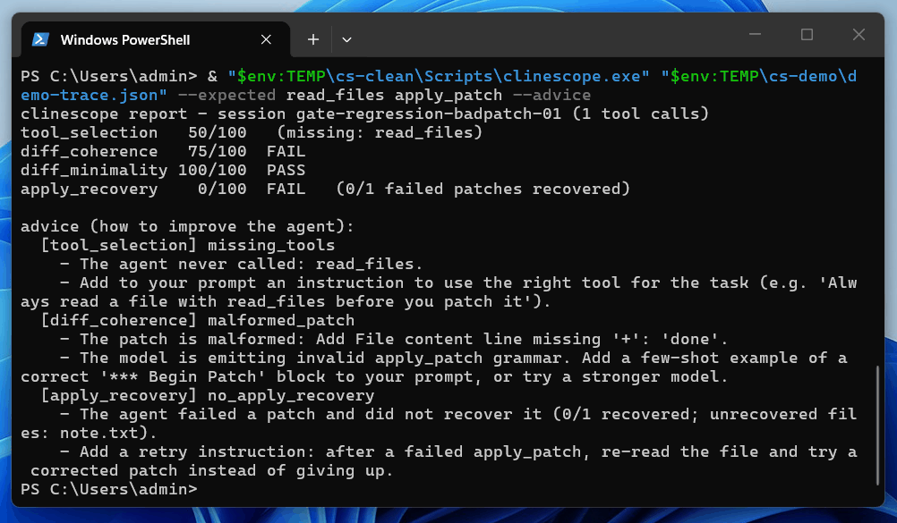

# Clinescope

[](LICENSE)


Clinescope is an AI evaluation tool that lives in your Cline development workflow, reads your logs, and helps you write better prompts by checking tool choices, catching messy code rewrites, and ensuring updates don't break past work.

Clinescope reads a Cline log and scores four things:

- **`tool_selection`**: did the agent call the tools the task needed?
- **`diff_coherence`**: are its code patches valid and well-formed?
- **`diff_minimality`**: are its edits small and focused, not bloated rewrites?
- **`apply_recovery`**: when a patch failed, did the agent fix it?

> Clinescope is an independent, unofficial tool - not affiliated with, endorsed by, or sponsored by Cline or Cline Bot Inc. "Cline" is a trademark of Cline Bot Inc., used only to describe compatibility.

<p align="center"></p>

## Get Started

1. **Install Clinescope**

    Requires Python 3.11+. Installing into a virtual environment is recommended.

    ```bash
    pip install "git+https://github.com/minh2416294/clinescope.git"
    ```

2. **Use Clinescope**

    **Get the score:**
  
    Point Clinescope at the Cline log file to score the run:
    ```bash
    clinescope path/to/messages.json --expected read_files apply_patch
    ```
    After `--expected`, list the tools you think the task needed. Clinescope checks whether the agent actually used them and scores the rest of the run automatically. Not sure which tool names to use? Run `clinescope --list-tools` to print the ones Clinescope knows.

    **Get full breakdown of every scorer:**
    ```bash
    clinescope path/to/messages.json --expected read_files apply_patch --verbose
    ```

    **Get advice to improve prompting:**
    ```bash
    clinescope path/to/messages.json --expected read_files apply_patch --advice
    ```

    **Compare several runs side by side:**

    Run the same task against different models (or Cline versions) and score them all in one table:
    ```bash
    python -m clinescope.compare run-a.json run-b.json run-c.json
    ```
    Each row is one run; the columns are the four scorers. To score `tool_selection` per run (each task expects different tools), pass a `--labels manifest.json` mapping each trace path to its `{"display": "...", "expected_tools": [...]}`.

## Validation Corpus

Clinescope ships a corpus of **real captured Cline runs** in [`examples/corpus/`](examples/corpus/), each hand-labeled in [`corpus.json`](examples/corpus/corpus.json) with its expected score profile, failure taxonomy, and the evidence its advice should name. A runner scores every trace, checks it against its label, prints a summary table, and **exits non-zero if any trace fails its label** — so the corpus is a real regression gate, not a demo:

```bash
python -m clinescope.corpus
```

This is the un-fakeable evidence that Clinescope catches real agent failures (and stays quiet on clean runs): the traces are real, the failures are real, and the runner proves Clinescope reproduces every labeled outcome. Six real traces cover three of the four failure modes; the fourth (`blind_rewrite`) is an honestly-stated gap — see [`examples/corpus/README.md`](examples/corpus/README.md) for the coverage table and why no local model produced it.

## Reporting Bugs

Small, discussed-first changes are welcome -- see [CONTRIBUTING.md](CONTRIBUTING.md) for dev setup, tests, and what a scorer change needs. You can file a [GitHub issue](https://github.com/minh2416294/clinescope/issues).

## License

[Apache-2.0](LICENSE). Copyright 2026 Tran Binh Minh.
