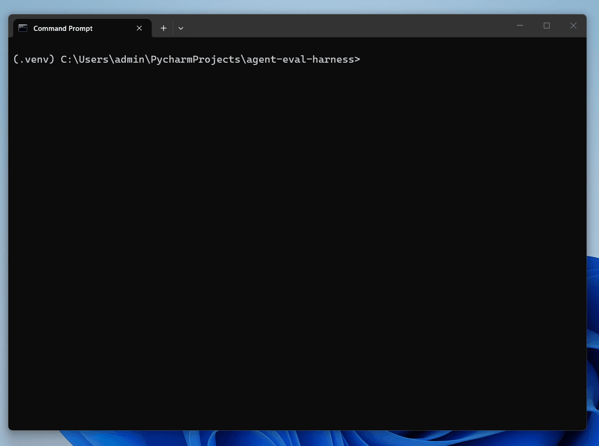

# Clinescope

[](https://github.com/minh2416294/clinescope/actions/workflows/ci.yml)
[](LICENSE)


Clinescope is an AI evaluation tool that lives in your development workflow, reads your Cline logs, and helps you ship better prompts by checking tool choices, catching messy block rewrites, and ensuring updates don't break past work.

> Clinescope is an independent, unofficial tool - not affiliated with, endorsed by, or sponsored by Cline or Cline Bot Inc. "Cline" is a trademark of Cline Bot Inc., used only to describe compatibility.

<!-- Demo GIF goes here: record a run of `clinescope <trace.json>` and add it as  once docs/demo.gif exists. -->


## Get started

Requires Python 3.11+.

**macOS / Linux:**

```bash
pipx install "git+https://github.com/minh2416294/clinescope.git"
```

**Windows:**

```powershell
py -m pip install --user pipx
py -m pipx ensurepath        # then open a NEW terminal so PATH updates
pipx install "git+https://github.com/minh2416294/clinescope.git"
```

Then point it at a Cline `messages.json` trace:

```bash
clinescope path/to/messages.json --expected read_files apply_patch
```

`--expected` lists the tool names the task should have used. clinescope prints a report scoring tool
selection, diff coherence, diff minimality, and apply-recovery - and, opt-in, validates its own LLM judge
against human labels (Cohen's κ). It reads the trace read-only and never touches your files.

New here? Clone the repo and score the bundled example to see the output — no install needed:

```bash
git clone https://github.com/minh2416294/clinescope
cd clinescope
PYTHONPATH=src python -m clinescope examples/sample-trace.json --expected read_files apply_patch
```

## Contributing

Small, discussed-first changes are welcome - see [CONTRIBUTING.md](CONTRIBUTING.md) for dev setup, tests, and what a scorer change needs.

## License

[Apache-2.0](LICENSE). Copyright 2026 Tran Binh Minh.
