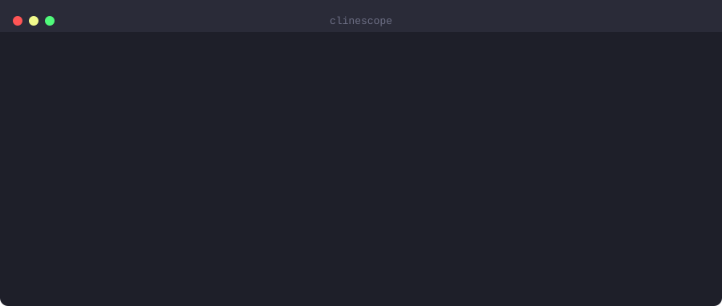

# Clinescope

[](LICENSE)


> Clinescope is an independent, unofficial tool - not affiliated with, endorsed by, or sponsored by [Cline](https://cline.bot/) or Cline Bot Inc. "Cline" is a trademark of Cline Bot Inc., used only to describe compatibility.

**Clinescope runs on the Cline CLI and the VS Code extension.** Run `clinescope --vscode` to auto-discover and score a VS Code extension session (see [Score a VS Code extension session](docs/usage.md#score-a-vs-code-extension-session)).

Clinescope is a Cline eval harness that lives in your Cline development workflow, reads your logs, and helps you write better prompts by checking tool choices, catching messy code rewrites, and flagging failed patches the agent never retried. Clinescope reads a Cline log and scores four things:

- **`tool_selection`**: did it call the tool names you passed to `--expected`?
- **`diff_coherence`**: does its `apply_patch` text parse against Cline's `*** Begin Patch` grammar? It does not check that the patch applies.
- **`diff_minimality`**: does any hunk delete three or more lines in a row and then add three or more, keeping no anchor line between them?
- **`apply_recovery`**: after a patch Cline marked failed, did a later patch Cline confirmed touch the same file?

The file it reads is not a scraped log. The Cline CLI's `messages.json` has been a published, versioned contract since 2026-04-22, and that contract states a downstream consumer should be able to reconstruct a full session trajectory from the file alone: [`messages-contract-v1.md`](https://github.com/cline/cline/blob/main/sdk/packages/core/docs/messages-contract-v1.md).

<p align="center"></p>

<p align="center"><em>Three real captured runs; run <code>clinescope --demo</code> to score one yourself.</em></p>

## Why Clinescope

Clinescope scores **coding-agent execution traces**. `diff_coherence` parses the agent's `apply_patch` text against Cline's `*** Begin Patch` grammar; it does not check that the patch applies. `diff_minimality` flags one shape: a hunk that deletes a run of three or more consecutive lines and then adds a run of three or more, with no anchor line kept between them. `apply_recovery` reads Cline's own failed and applied verdicts and reports, for each file a failed patch touched, the fraction later re-touched by a patch Cline confirmed. The first two read only the patch text; the third reads Cline's verdicts. None of them judges whether the code is correct. DeepEval scores tool selection but not code patches or diffs; promptfoo, Langfuse, and Braintrust hand the diff scorer to you; UK AISI's Inspect grades SWE-bench by running the repo's tests against the files the agent edited, and its built-in scorers grade answers, not patch text. Those checks run against real captured Cline traces (see the [validation corpus](examples/corpus/README.md)).

Clinescope validates its own optional LLM judge against human labels and, finding it agrees only at chance level, deliberately keeps it out of the pass/fail gate. See [`docs/judge-validation.md`](docs/judge-validation.md). The same 50 labels were then turned on a scorer that *is* gated: `diff_minimality` agrees at Cohen's kappa 0.2599 and flagged 7 of the 24 patches a human called wasteful, and its `--min-diff-minimality` flag has never failed a build on any real captured trace shipped here. A trace captured off-repo has since made it fail, and showed the same edit scoring 1.0 or 0.0 depending on the layout of the edited file. The other two gated scorers have no agreement number at all, so read their silence as unmeasured rather than as validated. Each scorer is deliberately narrow; what it does and does not measure is spelled out in [LIMITATIONS.md](LIMITATIONS.md).

Clinescope was built largely with an AI coding agent. How it stayed correct anyway (frozen invariants, verification-first checks, an AI signal measured and then kept out of the gate) is written up in [docs/building-with-agents.md](docs/building-with-agents.md).

Clinescope reads a format Cline owns, which puts Cline in a better position to build this than anyone outside the project, and nothing here prevents that. If it happens it hurts, and the specific way it hurts is worth knowing before you depend on this: the three diff scorers are welded to Cline's `apply_patch` grammar, so they do not port to another agent without being rewritten, and the case for a separate tool would narrow to whether you want the thing scoring an agent shipped by the same people who ship the agent. That is a real argument. It is not a large one. What outlives the risk is the part that is not format-specific: a corpus of real captured traces, a gold set of 50 authored patches labeled by one person, and the agreement numbers measured against that gold set, including the ones that came out badly. If that dependency is disqualifying for you, better to know now than after you have wired this into CI.

## Get Started

1. **Install Clinescope**

    Requires Python 3.11+ (`python --version`). Install into a virtual environment; the [quickstart](docs/quickstart.md#1-install-clinescope) has the create-and-activate steps for PowerShell, CMD, and macOS/Linux.

    ```bash
    python -m pip install clinescope
    ```

    Install trouble (a broken `pip` launcher, `command not found`, wrong Python)? See [Install troubleshooting](docs/quickstart.md#install-troubleshooting).

2. **Use Clinescope**

    **Get the score:**

    Point Clinescope at a Cline log file (a `messages.json` trace) to score the run - replace `path/to/messages.json` below with your own.

    ```bash
    clinescope path/to/messages.json --expected read_files apply_patch
    ```

    After `--expected`, list the tools you think the task needed. Run `clinescope --list-tools` to print the tools in Clinescope.

    **Improve your prompt:**

    ```bash
    clinescope path/to/messages.json --expected read_files apply_patch --advice
    ```

Learn more in the [usage guide](docs/usage.md). New to this? The [quickstart](docs/quickstart.md) walks you from installing Cline to scoring your own session.

## Feedback

Ran Clinescope on your own Cline trace? Tell me how it went, what worked, or what was confusing: open a [feedback issue](https://github.com/minh2416294/clinescope/issues/new/choose) and pick "Share feedback". First-run impressions on a real trace are the single most useful thing you can send.

For a reproducible scorer or CLI bug, the [Bug report](https://github.com/minh2416294/clinescope/issues/new/choose) form is a better fit. To contribute a change, see [CONTRIBUTING.md](CONTRIBUTING.md) for dev setup, tests, and what a scorer change needs.

## License

[Apache-2.0](LICENSE). Copyright 2026 Tran Binh Minh.
