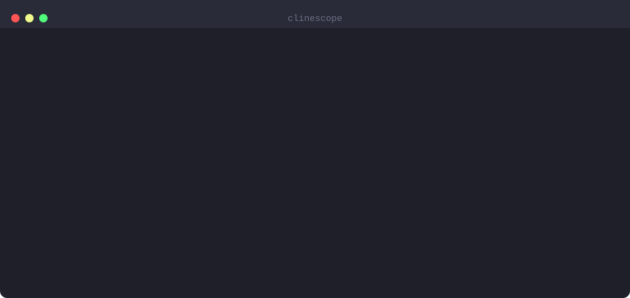

# Clinescope

[](LICENSE)


> Clinescope is an independent, unofficial tool - not affiliated with, endorsed by, or sponsored by [Cline](https://cline.bot/) or Cline Bot Inc. "Cline" is a trademark of Cline Bot Inc., used only to describe compatibility.

**Clinescope runs on the Cline CLI and the VS Code extension.** Run `clinescope --vscode` to auto-discover and score a VS Code extension session (see [Score a VS Code extension session](docs/usage.md#score-a-vs-code-extension-session)).

Clinescope reads the log of one Cline run and scores it on six checks. By default it says in plain English what went wrong, what to do about it, why the check could be wrong, and what went well. `--details` shows the technical report instead: each check's name and score, with the same advice.

| Check | What it tells you | What it does not tell you |
|---|---|---|
| `tool_selection` | Whether the agent used the tools you listed after `--expected`. | Whether it gave those tools the right inputs. |
| `tool_input` | Whether some `editor` call carried an input you named after `--expected-input`, such as a file path. | Whether that call worked, or what the other calls sent. |
| `diff_coherence` | Whether the agent's first `apply_patch` patch is written in the format Cline expects. | Whether that patch would apply to your file. |
| `diff_minimality` | Whether a patch deleted a block of lines and wrote a new one, keeping none of the old lines. | Whether that rewrite was a mistake. Sometimes it is the right move. |
| `apply_recovery` | After a failed `apply_patch`, whether a later patch to the same file went through. | Whether the later patch fixed the problem. |
| `editor_recovery` | The same, for Cline's `editor` tool. | The same. |

Most Cline sessions today use `editor`. On those runs the three patch checks are listed under "Did not apply". In `--details`, a `note:` line says they did not run, and all three show `n/a`.

In `--details`, when a run has an `apply_patch`, a `cline_verdict` line under `diff_coherence` shows what Cline did with that same patch: `applied`, `rejected` (with Cline's own reason), or `no verdict`. A patch can pass `diff_coherence` and still be rejected, because the check reads the patch text while Cline tries it on your file. The line is not a score.

`--test-cmd TEXT` asks whether a command containing TEXT ran after the last edit, and what Cline recorded for it (`success`, or Cline's own error text). It runs nothing and does not prove the fix works. Cline keeps one flag for a whole command line, so `pytest; echo done` can read `success` after pytest failed. The last edit counts any file, so a helper script written after the tests also reads `not run`. A `not run`, or a run Cline marked failed, is reported as a problem.

An `editor_newlines` problem appears only when an `editor` call that Cline accepted replaced text that had real line breaks with one line holding literal `\n` instead. In one real run that call turned a whole file into one line with 78 literal `\n`, Python could not parse it, and every check still passed. It is not a score. It never opens the file, it does not check a new file written this way, and it does not look at later edits.

<p align="center"></p>

<p align="center"><em>Three real captured runs; run <code>clinescope --demo</code> to score one yourself.</em></p>

## Why Clinescope

A Cline run can include a failed edit that the agent never went back to. You only find it by reading the whole log. Clinescope reads the log for you and points at the problem.

- **No setup.** It reads the log Cline already writes. The scores need no AI model, no API key, no network, and no other packages.
- **It names what went wrong.** A failed patch that was never retried, a tool you expected that never got called, a block of lines deleted and rewritten.
- **It tells you what to change.** Every problem comes with what to do (often an instruction you can add to your prompt or your Cline rules) and the limit of the check that found it.
- **It can guard your CI.** `clinescope-gate` fails the build when a score drops below the bar you set.
- **Same log, same score.** No model is involved, so a score only moves when the run changed.

I read five eval tools on 2026-09-13: DeepEval, promptfoo, Langfuse, Braintrust and Inspect. None ships a built-in check for patch format, for block rewrites, or for recovery after a failed patch ([sources](docs/internal/COMPARISONS.md)). Clinescope does not tell you whether the code is correct. Its limits are in [LIMITATIONS.md](LIMITATIONS.md).

## Get Started

1. **Install Clinescope**

    Requires Python 3.11+ (`python --version`). Install into a virtual environment; the [quickstart](docs/quickstart.md#1-install-clinescope) has the create-and-activate steps for PowerShell, CMD, and macOS/Linux.

    ```bash
    python -m pip install clinescope
    ```

    Install trouble (a broken `pip` launcher, `command not found`, wrong Python)? See [Install troubleshooting](docs/quickstart.md#install-troubleshooting).

2. **Use Clinescope**

    **Get the score:**

    Point Clinescope at a Cline log file (a `messages.json` trace) to score the run - replace `path/to/messages.json` below with your own.

    ```bash
    clinescope path/to/messages.json --expected read_files apply_patch
    ```

    After `--expected`, list the tools you think the task needed. Run `clinescope --list-tools` to print the tools in Clinescope. The report lists each problem with what to do about it.

    **See the technical report:**

    ```bash
    clinescope path/to/messages.json --expected read_files apply_patch --details
    ```

Learn more in the [usage guide](docs/usage.md). New to this? The [quickstart](docs/quickstart.md) walks you from installing Clinescope to scoring your own session, and step 2 links out to Cline's own docs if you still need the Cline CLI itself.

## Feedback

Ran Clinescope on your own Cline trace? One question: did anything in the report disagree with your own read of the run? Tell me which part on the [feedback form](https://github.com/minh2416294/clinescope/issues/new?template=feedback.yml). A result you think is wrong is the single most useful thing you can send, because it is the only answer that tells me something the code does not already say.

For a reproducible scorer or CLI bug, the [Bug report](https://github.com/minh2416294/clinescope/issues/new/choose) form is a better fit. To contribute a change, see [CONTRIBUTING.md](CONTRIBUTING.md) for dev setup, tests, and what a scorer change needs.

## License

[Apache-2.0](LICENSE). Copyright 2026 Tran Binh Minh.
